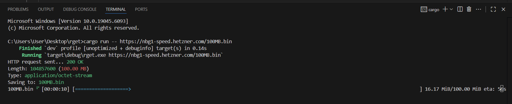

````markdown
# Rget

**Rget** is a simple `wget`-like command-line tool written in Rust.  
It downloads files from the internet and shows a progress bar (unless you disable it).

## Features

- Download any file by URL
- Progress bar with ETA and bytes transferred
- Quiet mode to hide the progress bar
- Human-readable file sizes

## Installation

1. Make sure you have [Rust](https://www.rust-lang.org/) installed.
2. Clone or download this repository.
3. In the project folder, run:
   ```bash
   cargo build --release
   ```
````

The compiled binary will be in `target/release/rget`.

## Usage

```bash
rget [OPTIONS] <URL>
```

### Arguments:

- `<URL>` – The file URL to download (required).

### Options:

- `-q`, `--quiet` – Disable the progress bar.
- `-h`, `--help` – Show help information.
- `-V`, `--version` – Show version information.

## Examples

Download with progress bar:

```bash
cargo run -- https://nbg1-speed.hetzner.com/100MB.bin
```

Download quietly (no progress bar):

```bash
cargo run -- -q https://nbg1-speed.hetzner.com/100MB.bin
```

Show help:

```bash
cargo run -- --help
```

Show version:

```bash
cargo run -- --version
```

## Screenshot

Here’s an example of the progress bar while downloading:



> To replace this, run `cargo run -- <URL>` in your terminal, take a screenshot, and save it as `screenshot.png` in the project root.

## License

MIT
